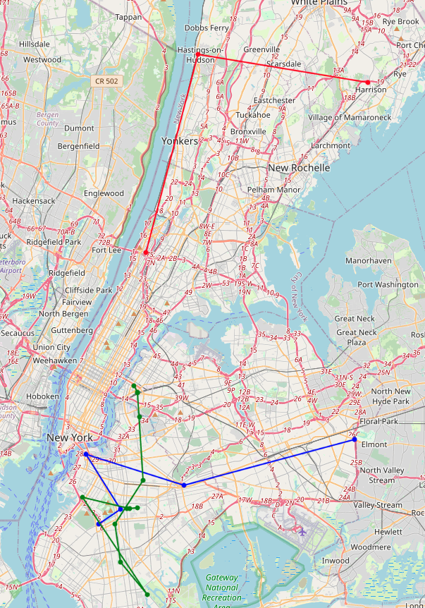
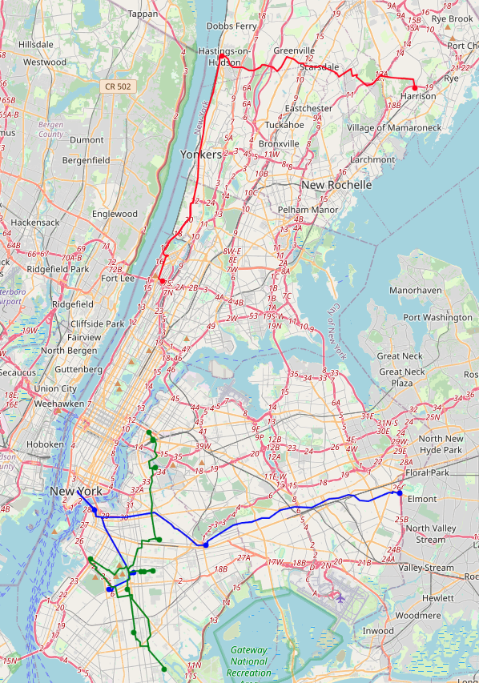

# logistics-multi-vehicles
Logistics optimization algorithm for multiple vehicles.

### Objective
Select the largest quantity possible.

### Constraints
1. There are N vehicles.
2. A location must be visited only once.
3. There is no depot (It can start from anywhere and arrive anywhere).
4. There is a working time for deliver.
5. There is a capacity of logistics vehicle.
6. A penalty is given for the number of locations that could not visited.

### Solver requirements
* Gurobipy version: 10.0.3

### My own python modules
It is for using my route planning algorithm (```planner.cpp```) in Python3. 
pybind11 is a header library facilitating seamless C++ and Python interoperability with minimal code, 
making it straightforward to expose C++ functions and classes to Python.
#### Install pybind11
Using APT,
```python
sudo apt update
sudo apt install pybind11-dev
```
#### Compile
```python
c++ -O3 -Wall -shared -std=c++11 -fPIC $(python3 -m pybind11 --includes) astar.h astar.cpp planner.cpp -o planner.so
```

### Run demo code
```pyton
python3 main.py -call ${delivery_location} {number_of_delivered_items} -t ${working_time} -c ${capacity} -penalty ${penalty} -v ${number_of_delivers}
```

### Example
* Delivery calls

|               | 1  | 2  | 3  | 4  | 5  |  6  |  7  |  8  |  9  | 10  | 11  | 12  | 13  | 14  | 15  | 16  |  17  |  18  |  19  |  20  |
|:-------------:|:--:|:--:|:--:|:--:|:--:|:---:|:---:|:---:|:---:|:---:|:---:|:---:|:---:|:---:|:---:|:---:|:----:|:----:|:----:|:----:|
|  Location ID  | 47 | 52 | 55 | 60 | 80 | 120 | 244 | 256 | 300 | 440 | 442 | 508 | 532 | 642 | 842 | 900 | 1000 | 1014 | 1017 | 1572 |
| # of packages | 5  | 7  | 12 | 2  | 9  | 11  | 21  |  5  | 10  | 11  |  8  |  3  | 14  | 10  |  6  |  8  |  2   |  13  |  20  |  12  |
* Working time: an hour
* Capacity: 200
* Penalty: 10
* Number of delivers: 3
```python
python3 main.py -call 47 5 -call 52 7 -call 55 12 -call 60 2 -call 80 9 -call 120 11 -call 244 21 -call 256 5 -call 300 10 -call 440 11 -call 442 8 -call 508 3 -call 532 14 -call 642 10 -call 842 6 -call 900 8 -call 1000 2 -call 1014 13 -call 1017 20 -call 1572 12 -t 3600 -cap 200 -penalty 10 -v 3
```

### Result
| Driver ID |                                          Path                                           | Number of serviced packages | Traveling time (secs) |
|:---------:|:---------------------------------------------------------------------------------------:|:---------------------------:|:---------------------:|
|     0     |                                    [1572, 1017, 300]                                    |             42              |        3101.91        |
|     1     |                                [1000, 60, 900, 642, 842]                                |             28              |        3104.3         |
|     2     |                [244, 442, 440, 120, 80, 508, 532, 1014, 256, 52, 47, 55]                |             119             |        3461.71        |
<center>
 
</center>
The left is a sequence of locations and the right is a detailed path.